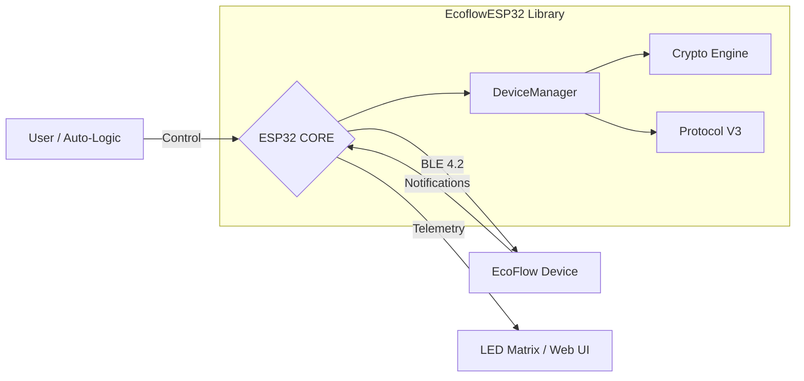

# ⧉ ECOFLOW-ESP32 // CYBER_DECK


> **WARNING:** UNAUTHORIZED CLOUD DISCONNECTION IMMINENT.
> **TARGET:** LOCAL CONTROL ESTABLISHED.

**EcoflowESP32** is a futuristic, reverse-engineered C++ library for the ESP32 that enables **direct, offline control** of EcoFlow power stations via Bluetooth Low Energy (BLE). No clouds, no servers, just you and your hardware.

---

## ≡ SYSTEM CAPABILITIES

*   **[>> COMPLETE LOCAL CONTROL]**: Bypass the cloud. Toggle AC/DC/USB ports directly from your microcontroller.
*   **[>> REAL-TIME TELEMETRY]**: Monitor battery levels, input/output wattage, and temperatures with millisecond precision.
*   **[>> CRYPTOGRAPHIC SECURITY]**: Full implementation of the EcoFlow ECDH + AES-128 handshake.
*   **[>> MULTI-DEVICE SUPPORT]**: Seamlessly manage Delta 3, Wave 2, and Delta Pro 3 devices simultaneously.

---

## ≡ SUPPORTED HARDWARE

| DEVICE | ID | STATUS | PROTOCOL |
| :--- | :--- | :--- | :--- |
| **EcoFlow Delta 3** | `D3` | **[FULL ACCESS]** | V3 (Protobuf) |
| **EcoFlow Wave 2** | `W2` | **[PARTIAL]** | V2 (Binary) |
| **EcoFlow Delta Pro 3** | `D3P` | **[BETA]** | V3 (Protobuf) |
| **Alternator Charger** | `AC` | **[BETA]** | V3 (Protobuf) |

---

## ≡ QUICK DEPLOYMENT

### 1. INITIALIZE PROTOCOL
Clone the repo into your PlatformIO `lib/` directory.

```bash
git clone https://github.com/YourRepo/EcoflowESP32.git lib/EcoflowESP32
```

### 2. CONFIGURE CREDENTIALS
Create `src/Credentials.h`:
```cpp
#define ECOFLOW_USER_ID "USER_ID_FROM_APP"
#define ECOFLOW_DEVICE_SN "DEVICE_SERIAL_NUMBER"
#define ECOFLOW_KEYDATA "APP_KEY_HEX_STRING"
```

### 3. FLASH FIRMWARE
```cpp
#include "DeviceManager.h"

void setup() {
    // BOOT SYSTEM
    DeviceManager::getInstance().initialize();

    // INITIATE SCAN
    DeviceManager::getInstance().scanAndConnect(DeviceType::DELTA_3);
}

void loop() {
    // MAINTAIN LINK
    DeviceManager::getInstance().update();
}
```

---

## ≡ DOCUMENTATION MATRIX

Access the classified technical archives for deep implementation details.

| [SYSTEM ARCHITECTURE](docs/Architecture.md) | [PROTOCOL REFERENCE](docs/Protocol.md) |
| :---: | :---: |
|  |  |
| **Class Diagrams & Logic Flow** | **Byte-level V2/V3 Analysis** |

| [HARDWARE SCHEMATICS](docs/Hardware_Reference.md) | [CODEBASE MAP](docs/Code_Reference.md) |
| :---: | :---: |
|  |  |
| **Pinouts & Wiring Diagrams** | **Class & Method Reference** |

---

## ≡ SYSTEM OVERVIEW



---

> *END OF LINE.*
