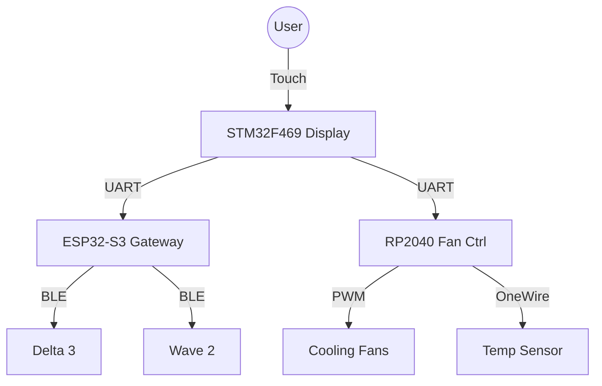

# EcoFlow Monitor

**A comprehensive, local-only monitoring and control system for EcoFlow power stations.**

## Overview

EcoFlow Monitor is a custom embedded solution designed to interface with EcoFlow devices (such as Delta 3, Delta Pro 3, and Wave 2) without relying on the manufacturer's cloud services. It uses Bluetooth Low Energy (BLE) to communicate directly with the devices, ensuring privacy and operation in off-grid environments.

The project is split into three modular components:
1.  **ESP32-S3 (Gateway):** Handles BLE communication with the EcoFlow devices and bridges data to the display.
2.  **STM32F469 (Display):** Provides a rich, touch-enabled graphical user interface (LVGL) for monitoring and control.
3.  **RP2040 (Fan Controller):** Manages cabinet cooling with PWM fan control based on thermal readings.

## Features

-   **Cloud-Independent:** Fully local control via BLE. No internet connection required.
-   **Multi-Device Support:**
    -   **Delta 3:** Full telemetry (Battery, Input/Output, Port states) and charging controls.
    -   **Delta Pro 3:** High/Low voltage port monitoring and split solar inputs.
    -   **Wave 2:** Climate control (Cool/Heat/Fan), temperature monitoring, and mode switching.
    -   **Alternator Charger:** Basic monitoring of vehicle charging systems.
-   **Rich UI:** 800x480 Touchscreen Dashboard with real-time graphs and animations.
-   **Thermal Management:** Integrated automatic fan control for the equipment cabinet.
-   **Debug Tools:** On-screen debug console and raw data inspection.

## Architecture

## Documentation

Comprehensive documentation is available in the **Wiki**.

-   [**Home**](Wiki/Home.md): Project overview and navigation.
-   [**EcoFlow Protocol**](Wiki/EcoFlow_Protocol.md): Deep dive into the reverse-engineered BLE protocol.
-   [**Inter-Device Protocol**](Wiki/Inter_Device_Protocol.md): Details on the internal serial communication.
-   [**Device: ESP32**](Wiki/Device_ESP32.md): BLE client and gateway firmware details.
-   [**Device: STM32**](Wiki/Device_STM32.md): UI, FreeRTOS structure, and display logic.
-   [**Device: RP2040**](Wiki/Device_RP2040.md): Fan control algorithm and hardware.

## Installation & Build

Please refer to the Wiki for detailed build instructions. The project uses **PlatformIO** for all microcontrollers.

## License

This project is open-source.
**Author:** Lollokara
