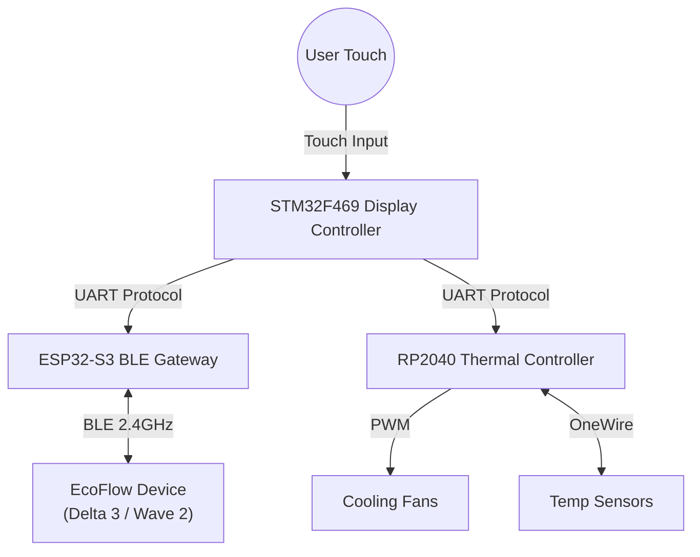

# Home: The EcoFlow BLE Monitor

**Author:** Lollokara

## Overview

The **EcoFlow BLE Monitor** is a high-performance, embedded solution for monitoring and controlling EcoFlow portable power stations without relying on the manufacturer's cloud infrastructure.

By implementing the proprietary EcoFlow V2 and V3 BLE protocols directly on a microcontroller, this project enables:
*   **Privacy:** No usage data is sent to external servers.
*   **Reliability:** Control your device even during internet outages.
*   **Integration:** Can be extended to integrate with Home Assistant or other local automation systems (via the STM32).

## System Architecture

The system is designed as a distributed embedded cluster, separating concerns across three specialized microcontrollers to maximize performance and stability.

### 1. The Display Controller (STM32F469NI)
*   **Hardware:** STM32F469I-Discovery Kit.
*   **OS:** FreeRTOS.
*   **UI:** LVGL 8.3 running on a 4-inch 800x480 DSI Touchscreen.
*   **Responsibilities:**
    *   Renders the Dashboard and Settings menus.
    *   Manages the "Master" state of the system.
    *    polls the ESP32 for data updates.
    *   Sends control commands (AC On, Fan Speed, etc.) to the Gateway.

### 2. The BLE Gateway (ESP32-S3)
*   **Hardware:** Generic ESP32-S3 DevKit.
*   **Framework:** Arduino / NimBLE.
*   **Responsibilities:**
    *   Scans for EcoFlow devices.
    *   Performs the ECDH Key Exchange and Authentication Handshake.
    *   Decrypts AES-128-CBC packets from the device.
    *   Parses Google Protobuf payloads into C structs.
    *   Serializes data for the STM32 via a high-speed UART link.

### 3. The Thermal Controller (RP2040)
*   **Hardware:** Raspberry Pi Pico (RP2040).
*   **Responsibilities:**
    *   Monitors cabinet/rack temperature via DS18B20 sensors.
    *   Controls 4x PC Case Fans via PWM.
    *   Reads fan Tachometer signals to detect failures.
    *   Reports thermal telemetry to the STM32.

## Goals

The primary goal is to provide a reference implementation for the complex EcoFlow BLE protocol in C++, moving away from Python-based implementations that are harder to embed in standalone hardware. This project proves that high-fidelity local control is possible on modest hardware.
