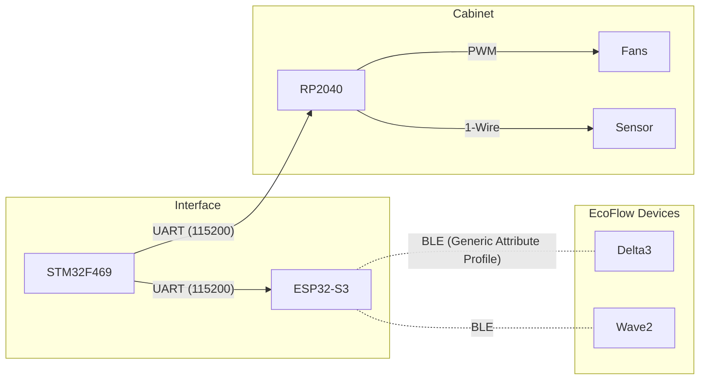

# Welcome to the EcoFlow Monitor Wiki

This Wiki documents the architecture, protocols, and implementation details of the EcoFlow Monitor project. It is intended for developers and enthusiasts who want to understand how the system works or contribute to the code.

## Navigation

### 📡 Protocols
*   [**EcoFlow Protocol**](EcoFlow_Protocol.md): A detailed analysis of the reverse-engineered BLE protocol used by EcoFlow devices (Protobufs, Command IDs, Encryption).
*   [**System Protocols**](Inter_Device_Protocol.md): Documentation of the custom UART protocols used between the ESP32, STM32, and RP2040.

### 🛠️ Hardware & Firmware
*   [**ESP32 Gateway**](Device_ESP32.md): The BLE central device. Handles connection management, encryption, and protocol translation.
*   [**STM32 Display**](Device_STM32.md): The main user interface. Runs FreeRTOS and LVGL to visualize data and capture user input.
*   [**RP2040 Fan Controller**](Device_RP2040.md): The thermal management subsystem. Controls cabinet fans based on temperature sensors.

## System Architecture

The system is designed as a distributed embedded application. The **ESP32** acts as the "backend," handling the complexity of the wireless BLE connection and cryptography. The **STM32** acts as the "frontend," presenting data to the user and issuing commands. The **RP2040** is a specialized "peripheral" for environmental control.

## Authors

*   **Lollokara** - *Core Architecture & Implementation*
