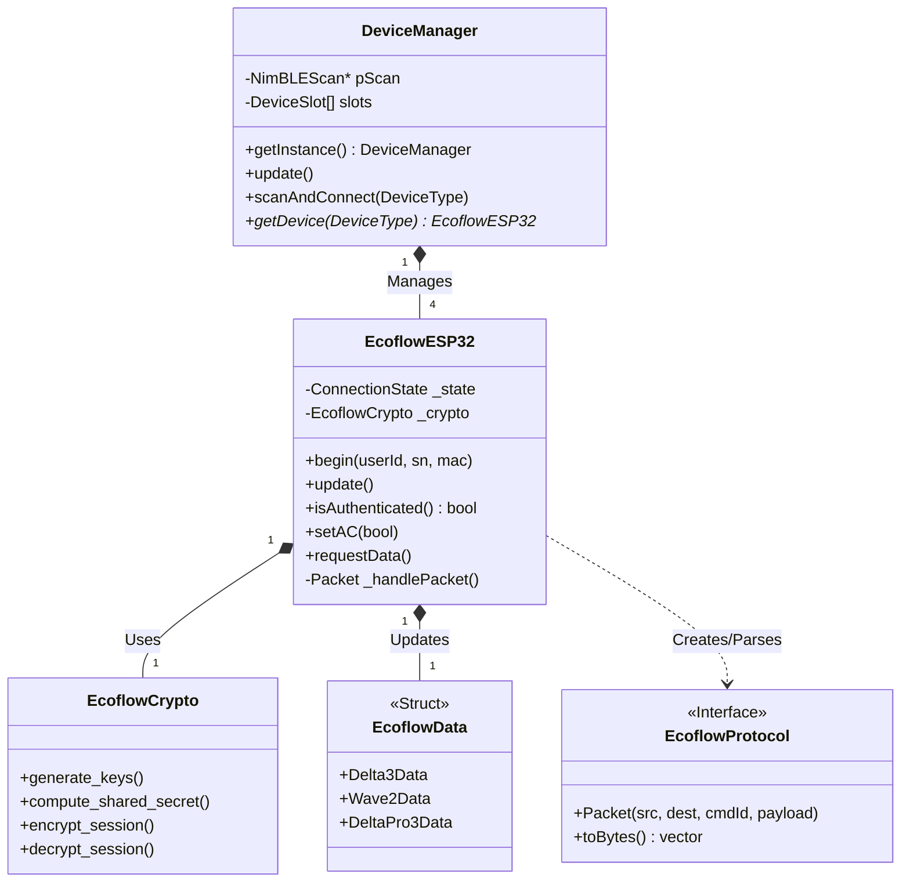
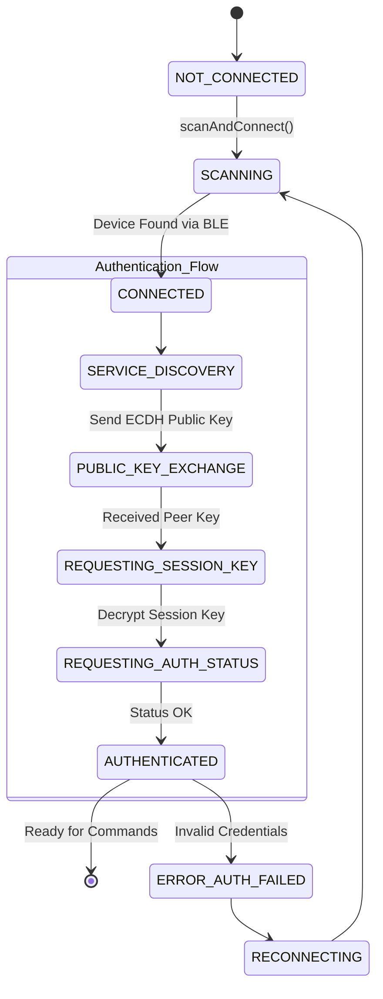

# ⧉ SYSTEM ARCHITECTURE // BLUEPRINTS

> **ACCESS LEVEL:** ADMIN
> **MODULE:** CORE_LOGIC

This document outlines the software architecture of the EcoflowESP32 library, detailing the relationship between the hardware abstraction layer, the protocol handler, and the application logic.

---

## ≡ CLASS HIERARCHY

The system is built around a singleton `DeviceManager` that orchestrates multiple `EcoflowESP32` instances. Each instance encapsulates the state and connection logic for a specific physical device.



---

## ≡ CONNECTION STATE MACHINE

The `EcoflowESP32` class implements a complex state machine to handle the BLE connection lifecycle, specifically the multi-stage authentication handshake required by EcoFlow devices.



### STATE DEFINITIONS

1.  **SCANNING:** The `DeviceManager` uses `NimBLE` to listen for advertising packets matching known EcoFlow manufacturer IDs.
2.  **SERVICE_DISCOVERY:** Once connected, the client discovers the primary command characteristic (UUID `00000002-0000-1000-8000-00805f9b34fb`).
3.  **PUBLIC_KEY_EXCHANGE:** The ESP32 generates an ephemeral ECDH key pair and sends its public key to the device.
4.  **REQUESTING_SESSION_KEY:** The device responds with its public key. The ESP32 computes the shared secret and requests the session key (salted with a random seed).
5.  **AUTHENTICATED:** AES-128-CBC encryption is enabled. All subsequent packets are encrypted.

---

## ≡ DATA FLOW PIPELINE

Data flows from the raw BLE notification through the decryption layer, into the protocol parser, and finally into the `EcoflowData` struct.

```mermaid
sequenceDiagram
    participant BLE as BLE Stack (NimBLE)
    participant ESP as EcoflowESP32
    participant CRY as EcoflowCrypto
    participant PAR as DataParser
    participant UI as Display/Web

    BLE->>ESP: Notification (Raw Bytes)
    ESP->>CRY: decrypt_session(Raw Bytes)
    CRY-->>ESP: Decrypted Payload
    ESP->>ESP: Validate Packet Header (CRC/Seq)
    ESP->>PAR: parsePacket(Payload)

    alt is Protobuf (Delta 3)
        PAR->>PAR: Decode pd335_sys.proto
    else is Binary (Wave 2)
        PAR->>PAR: Map Binary Offsets
    end

    PAR-->>ESP: Update EcoflowData Struct
    ESP-->>UI: Data Available for Rendering
```

---

> *SYSTEM INTEGRITY VERIFIED.*
> *ARCHITECTURAL DIAGRAMS RENDERED.*
