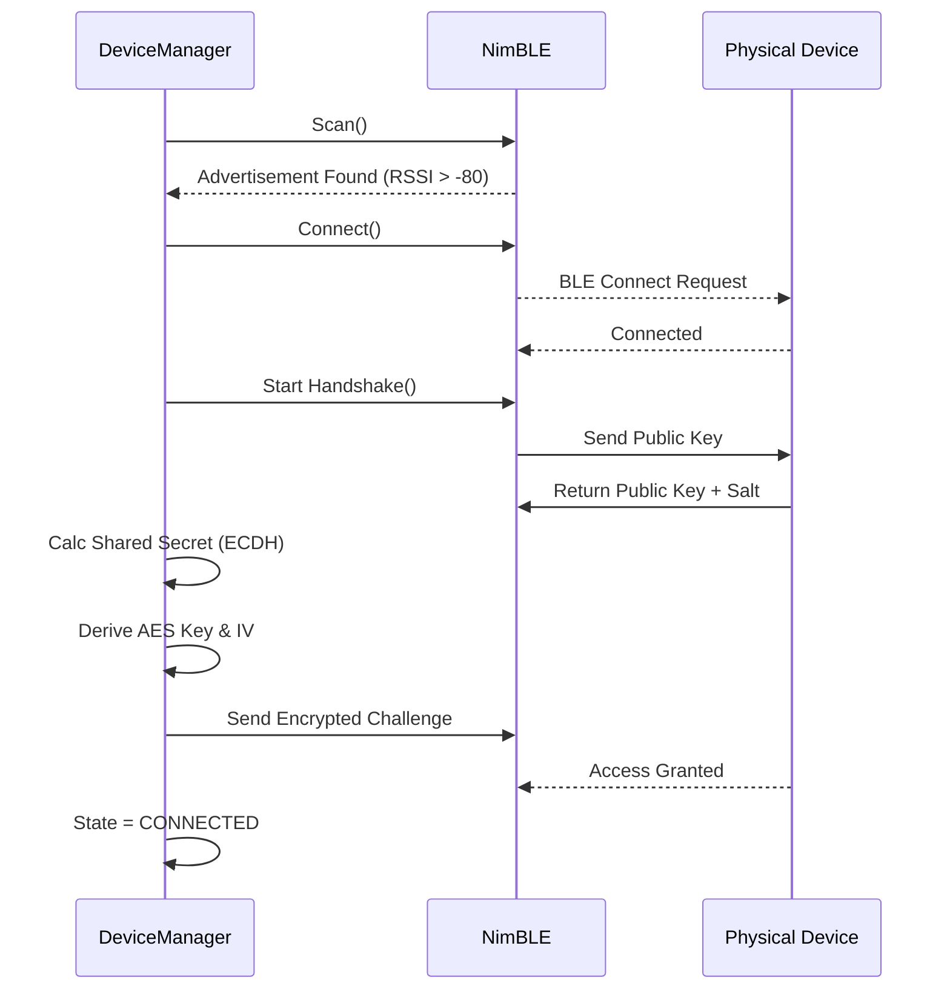
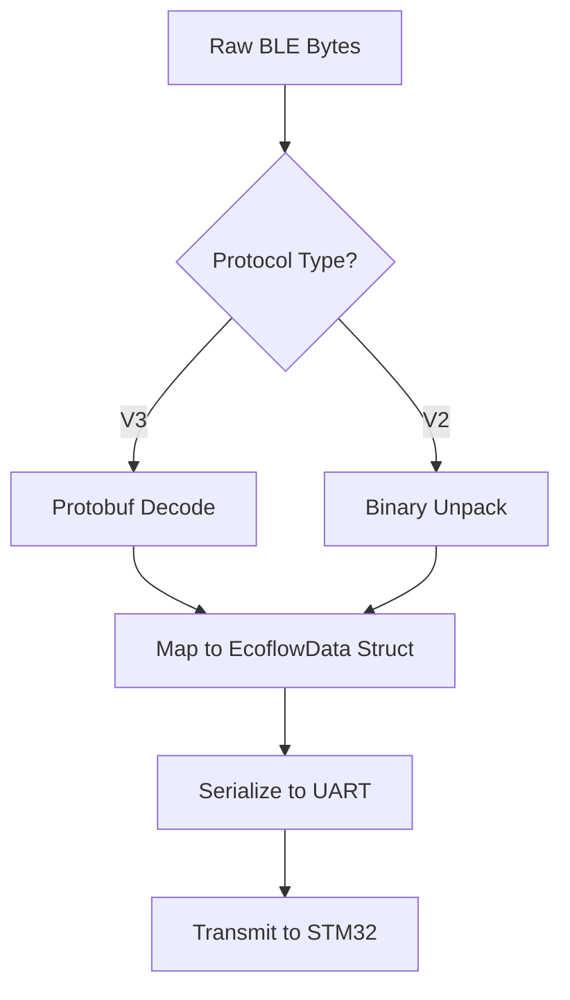

# ≡ ESP32 GATEWAY // CORE COMMS

> **HARDWARE:** ESP32-S3 DevKitC-1
> **ROLE:** NETWORK CONTROLLER & ENCRYPTION ENGINE

The **ESP32 Gateway** is the brain of the Cyber Deck's communication network. It handles the complexities of Bluetooth Low Energy (BLE), cryptographic handshakes, and protocol translation, presenting a clean interface to the rest of the system.

---

## ≡ KEY COMPONENTS

### 1. Device Manager (`DeviceManager.cpp`)
The central orchestrator.
*   **Scanning**: Continuously scans for EcoFlow devices matching the known Service UUIDs.
*   **Lifecycle**: Manages connection states (Connecting, Handshaking, Connected, Disconnected).
*   **Routing**: Routes incoming UART commands to the active BLE client.

### 2. BLE Client (`EcoflowESP32.cpp`)
Wraps the `NimBLE` library to provide a robust connection layer.
*   **MTU Negotiation**: Optimizes throughput by requesting max MTU.
*   **Notifications**: Subscribes to the specific characteristic UUIDs for telemetry.
*   **Reconnection**: Implements exponential backoff for auto-reconnection.

### 3. Protocol Parser (`EcoflowDataParser.cpp`)
The "Rosetta Stone" of the system.
*   **Protobuf**: Uses `nanopb` to decode the binary streams from Delta 3/Pro 3.
*   **Binary V2**: Manually parses the byte-packed structs from Wave 2.
*   **Normalization**: Converts all device-specific data into the standardized `DeviceStatus` struct for the STM32.

### 4. Crypto Engine (`EcoflowCrypto.cpp`)
Implements the security layer.
*   **Elliptic Curve**: `secp160r1` via `mbedtls`.
*   **AES-128-CBC**: Handles packet encryption/decryption.
*   **MD5**: Used for IV generation.

---

## ≡ CONFIGURATION

### Credentials (`src/Credentials.h`)
This file is **GIT IGNORED** for security. You must create it manually.

```cpp
// Your EcoFlow Account ID (found in app traffic or export)
#define ECOFLOW_USER_ID "1234567890"

// The Serial Number of the device you want to control
#define ECOFLOW_DEVICE_SN "R331Zxxxxxxxxx"

// The Hex-Encoded Key provided during account setup/sniffing
#define ECOFLOW_KEYDATA "09F91..."
```

---

## ≡ FLOW LOGIC

### Connection Sequence



### Protocol Translation



---

> *WARNING: Do not expose `Credentials.h` to public repositories.*
