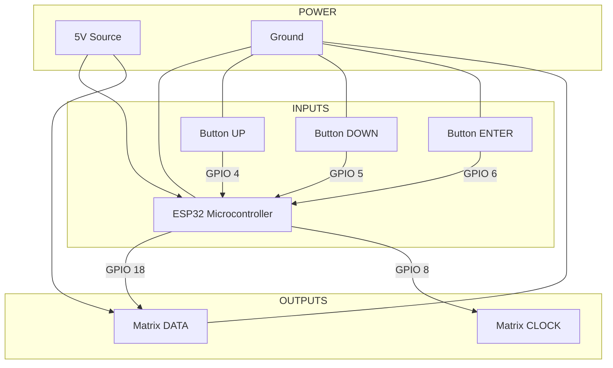

# ⧉ HARDWARE REFERENCE // SCHEMATICS

> **ACCESS LEVEL:** MAINTENANCE
> **TYPE:** PHYSICAL LAYER

This document details the hardware requirements, wiring schematics, and pinout configurations for building the EcoflowESP32 controller.

---

## ≡ COMPONENT LIST

| COMPONENT | SPECIFICATION | NOTES |
| :--- | :--- | :--- |
| **MCU** | ESP32-S3 / ESP32-WROOM | Must support BLE 4.2+ & WiFi. |
| **DISPLAY** | APA102 / DotStar Matrix | 9x20 Pixel Grid (Vertical ZigZag). |
| **BUTTONS** | 3x Tactile Switches | Normally Open (NO). |
| **POWER** | USB-C / 5V Regulated | Ensure stable 5V for LED Matrix. |

---

## ≡ WIRING DIAGRAM

### GPIO PINOUT

| GPIO PIN | COMPONENT | FUNCTION |
| :--- | :--- | :--- |
| **GPIO 4** | Button | **UP / PREVIOUS** |
| **GPIO 5** | Button | **DOWN / NEXT** |
| **GPIO 6** | Button | **ENTER / SELECT** |
| **GPIO 18** | LED Matrix | **DATA (DI)** |
| **GPIO 8** | LED Matrix | **CLOCK (CI)** |
| **GND** | Common | **Ground Reference** |

### CONNECTION SCHEMATIC



---

## ≡ LED MATRIX LAYOUT

The display driver (`Display.cpp`) assumes a custom **9x20 pixel** layout arranged in a **Vertical ZigZag** pattern.

*   **Height:** 9 Pixels
*   **Width:** 20 Pixels
*   **Pixel 0:** Top-Left
*   **Pixel 1:** Below Pixel 0 (Vertical fill first)

**Mapping Logic:**
```cpp
// Column 0: Top -> Bottom
// Column 1: Bottom -> Top
if (col % 2 == 1) {
    // Reverse direction for odd columns
    index = (col * height) + (height - 1 - row);
} else {
    // Normal direction for even columns
    index = (col * height) + row;
}
```

---

## ≡ BUTTON LOGIC

The input system uses a state machine to detect press duration on the **ENTER** button, allowing for three distinct actions on a single switch.

| ACTION | DURATION | TRIGGER | UI EFFECT |
| :--- | :--- | :--- | :--- |
| **SHORT PRESS** | < 1000ms | On Release | **Select / Toggle** |
| **MEDIUM PRESS** | 1000ms - 3000ms | On Release | **Back / Cancel** |
| **LONG PRESS** | > 3000ms | On Hold | **Save / Confirm** |

---

> *HARDWARE DIAGNOSTICS COMPLETE.*
> *CIRCUITS OPTIMIZED.*
