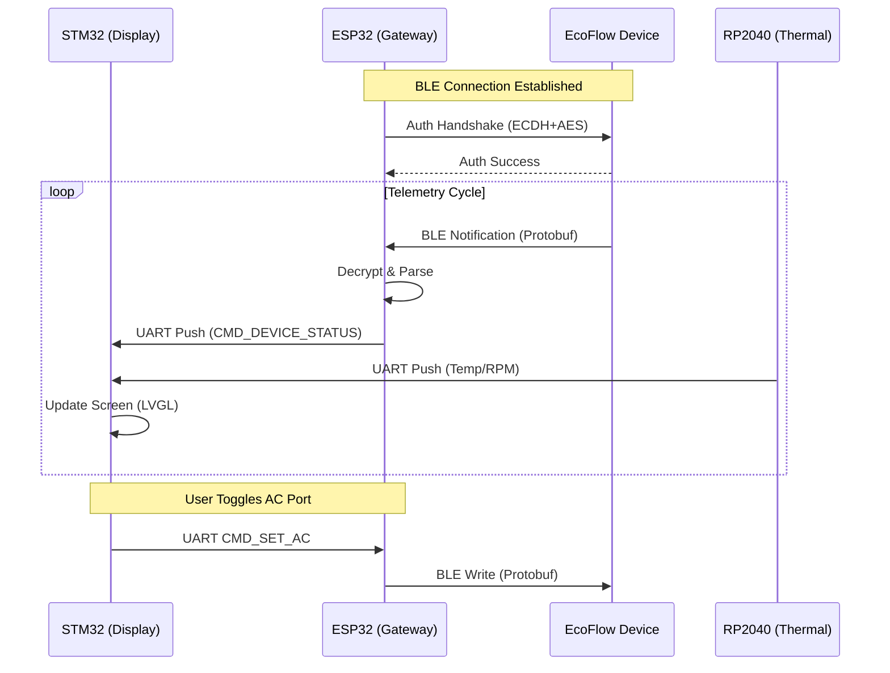

# ≡ SYSTEM ARCHITECTURE // INDEX

> **ACCESS LEVEL:** UNRESTRICTED
> **SUBJECT:** SYSTEM OVERVIEW

The **Ecoflow Cyber Deck** is a distributed control system designed to interface with EcoFlow power stations independently of the manufacturer's cloud infrastructure. It leverages a multi-MCU architecture to handle high-frequency telemetry, cryptographic handshakes, and a fluid user interface.

---

## ≡ MODULE OVERVIEW

### 1. [ESP32 GATEWAY](Device_ESP32.md)
**Role:** Communications & Logic Core
The ESP32-S3 acts as the central gateway. It manages the BLE connection to the EcoFlow device, handles the complex ECDH+AES authentication handshake, and translates the proprietary Protobuf/Binary protocol into a simplified UART stream for the display.
*   **Key Libs:** `NimBLE`, `mbedtls`, `Nanopb`.

### 2. [STM32 VISUAL INTERFACE](Device_STM32.md)
**Role:** Human-Machine Interface
The STM32F469I-Discovery board runs the graphical user interface. Powered by LVGL and FreeRTOS, it visualizes real-time power flows, allows port toggling, and manages the fan controller.
*   **Key Libs:** `LVGL 8.3`, `FreeRTOS`, `STM32Cube HAL`.

### 3. [RP2040 THERMAL CONTROLLER](Device_RP2040.md)
**Role:** Environmental Management
A dedicated RP2040 manages the cooling system for the Cyber Deck itself. It reads DS18B20 temperature sensors and drives 4-pin PWM fans, ensuring the electronics stay cool during high-load operation.
*   **Key Libs:** `Arduino Core`, `OneWire`.

---

## ≡ DATA FLOW ARCHITECTURE

The system operates on a **Hub-and-Spoke** model where the STM32 acts as the UI master, requesting data from the ESP32 (Hub).

---

## ≡ PROTOCOL SPECIFICATION

For a deep dive into the byte-level communication between the ESP32 and STM32, as well as the EcoFlow BLE protocol analysis, consult the **[PROTOCOL REFERENCE](Protocol.md)**.
