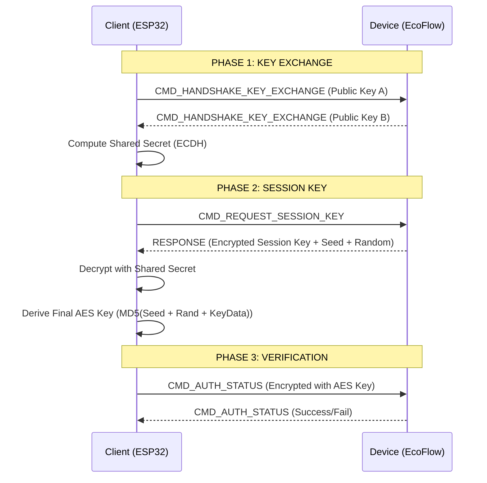

# ⧉ PROTOCOL REFERENCE // DEEP_DIVE

> **ACCESS LEVEL:** RESTRICTED
> **ENCRYPTION:** AES-128-CBC
> **PROTOCOLS:** V2 (Binary) / V3 (Protobuf)

This document provides a low-level reference for the EcoFlow BLE communication protocol, derived from reverse-engineering efforts and Python reference implementations.

---

## ≡ PACKET STRUCTURE

The protocol wraps payloads in a specific frame structure. The header format varies slightly between Protocol V2 (Wave 2) and Protocol V3 (Delta 3/Pro 3).

### V3 PACKET (DELTA SERIES)
Used by Delta 3, Delta Pro 3, and Alternator Charger.

| Offset | Length | Field | Value / Notes |
| :--- | :--- | :--- | :--- |
| 0x00 | 2 | **PREFIX** | `0xAA 0xAA` (Sync Word) |
| 0x02 | 1 | **ENC** | `0x00` (Plain) or `0x01` (Encrypted) |
| 0x03 | 1 | **LEN** | Length of payload + header |
| 0x04 | 1 | **TYPE** | Packet Type |
| 0x05 | 2 | **SEQ** | Sequence Number (Little Endian) |
| 0x07 | 4 | **CRC32** | Checksum of the packet |
| 0x0B | N | **PAYLOAD** | Protobuf Data (Encoded) |

### V2 PACKET (WAVE 2)
Used by Wave 2. It omits the source and destination fields found in older V1 packets but differs from V3 in header layout.

| Offset | Length | Field | Value / Notes |
| :--- | :--- | :--- | :--- |
| 0x00 | 2 | **PREFIX** | `0xAA 0xAA` |
| 0x02 | 1 | **CMD_SET** | Command Set ID (e.g., `0x42` for Wave 2) |
| 0x03 | 1 | **CMD_ID** | Command ID (e.g., `0x51` for Main Mode) |
| 0x04 | 2 | **LEN** | Payload Length |
| 0x06 | 1 | **FLAG** | Header Flag |
| 0x07 | 4 | **CRC** | Checksum |
| 0x0B | N | **PAYLOAD** | Binary Data (Fixed Offsets) |

---

## ≡ AUTHENTICATION HANDSHAKE

Authentication is mandatory for control commands. It uses an ECDH Key Exchange followed by a proprietary Session Key derivation.

### SEQUENCE DIAGRAM

### CRYPTOGRAPHIC PRIMITIVES
*   **Curve:** `secp160r1` (Custom domain parameters required in mbedTLS).
*   **Hash:** `MD5` (Used for key derivation).
*   **Cipher:** `AES-128-CBC` (Zero padding).
*   **Key Derivation:** The final session key is NOT the ECDH shared secret. It is derived by hashing the `shared_secret`, a static `ECOFLOW_KEYDATA` blob, and the handshake `seed`.

---

## ≡ COMMAND IDS

### SYSTEM COMMANDS
| Name | CmdSet | CmdId | Description |
| :--- | :--- | :--- | :--- |
| `HANDSHAKE` | 0x01 | 0x41 | Public Key Exchange |
| `SESSION_KEY` | 0x01 | 0x42 | Request Session Key |
| `AUTH_STATUS` | 0x01 | 0x43 | Verify Authentication |
| `PING` | 0x01 | 0x44 | Keep-alive heartbeat |

### WAVE 2 CONTROL (CMD_SET 0x42)
| CmdId | Function | Payload Type |
| :--- | :--- | :--- |
| `0x51` | Set Main Mode | Binary `[mode]` |
| `0x5C` | Set Ambient Light | Binary `[status]` |
| `0x5E` | Set Fan Speed | Binary `[speed]` |
| `0x58` | Set Temperature | Binary `[temp]` |

### DELTA 3 CONTROL (PROTOBUF)
Delta 3 uses `pd335_sys` Protobuf messages wrapped in the V3 packet structure.
*   **Message Type:** `ConfigWrite`
*   **Key Fields:**
    *   `cfg_ac_out_open`: Toggle AC
    *   `cfg_dc_12v_out_open`: Toggle DC
    *   `cfg_usb_open`: Toggle USB
    *   `cfg_max_chg_soc`: Charge Limit

---

> *PROTOCOL DECODED.*
> *PACKET INTERCEPTION SUCCESSFUL.*
