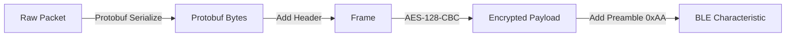

# ≡ PROTOCOL REFERENCE // DEEP DIVE

> **ACCESS LEVEL:** CLASSIFIED
> **SUBJECT:** COMMUNICATION PROTOCOLS

This document details the communication layers used within the Cyber Deck ecosystem, specifically the **Inter-MCU Protocol** (ESP32 <-> STM32) and the **EcoFlow BLE Protocol** (ESP32 <-> Device).

---

## ≡ PART 1: INTER-MCU PROTOCOL (UART)

The ESP32 and STM32 communicate via a high-speed UART link (115200 baud). This protocol is designed for reliability and low overhead.

### PACKET STRUCTURE
All frames follow this binary format:

`[START] [CMD] [LEN] [PAYLOAD] [CRC8]`

| Offset | Field | Description |
| :--- | :--- | :--- |
| 0x00 | **START** | Fixed `0xAA`. Sync byte. |
| 0x01 | **CMD** | Command ID (Operation Code). |
| 0x02 | **LEN** | Length of the `PAYLOAD` field (0-255). |
| 0x03 | **PAYLOAD** | Variable length data. |
| 0x03+N | **CRC8** | Maxim One-Wire CRC of CMD, LEN, and PAYLOAD. |

### COMMAND SET

#### 1. System Commands
| ID | Name | Direction | Description |
| :--- | :--- | :--- | :--- |
| `0x20` | `CMD_HANDSHAKE` | STM -> ESP | Initiates connection. |
| `0x21` | `CMD_HANDSHAKE_ACK` | ESP -> STM | Confirms connection. |
| `0x22` | `CMD_DEVICE_LIST` | ESP -> STM | Pushes list of discovered BLE devices. |
| `0x24` | `CMD_DEVICE_STATUS` | ESP -> STM | Pushes full telemetry struct for a device. |

#### 2. Control Commands
| ID | Name | Direction | Description |
| :--- | :--- | :--- | :--- |
| `0x30` | `CMD_SET_WAVE2` | STM -> ESP | Sets Wave 2 params (Mode, Temp, Fan). |
| `0x31` | `CMD_SET_AC` | STM -> ESP | Payload: `[0/1]`. Toggles AC Inverter. |
| `0x32` | `CMD_SET_DC` | STM -> ESP | Payload: `[0/1]`. Toggles DC/USB Ports. |
| `0x40` | `CMD_SET_VALUE` | STM -> ESP | Sets scalar limits (Charge Speed, SOC). |

### DATA STRUCTURES

#### DeviceStatus (CMD_DEVICE_STATUS)
The core telemetry packet. It contains a header and a union of device-specific data.

```c
struct DeviceStatus {
    uint8_t id;          // 1=D3, 2=DP3, 3=W2
    uint8_t connected;   // Boolean
    char name[16];       // "Delta 3"
    uint8_t brightness;  // 10-100%
    DeviceSpecificData data; // Union
};
```

---

## ≡ PART 2: ECOFLOW BLE PROTOCOL

The EcoFlow devices use two main protocol versions over BLE. The ESP32 abstracts these differences.

### AUTHENTICATION HANDSHAKE (V3)
Modern devices (Delta 3, Delta Pro 3) require an encrypted handshake.

1.  **Key Exchange (ECDH)**:
    *   Client sends public key (secp160r1).
    *   Device responds with its public key + random salt.
    *   Shared Secret is derived.
2.  **Secret Derivations**:
    *   **AES Key**: First 16 bytes of Shared Secret.
    *   **IV**: MD5 Hash of the full 20-byte Shared Secret.
3.  **Verification**:
    *   Client encrypts a known challenge.
    *   Device validates and unlocks the data stream.

### PACKET STRUCTURE (V3 PROTOBUF)
V3 packets are wrapped in an encrypted container.



*   **Preamble**: `0xAA`
*   **Header**: Contains version, sequence number, source/dest IDs.
*   **Payload**: Protobuf message (e.g., `pd335_sys_DisplayPropertyUpload`).
*   **CRC**: CRC16 checksum.

### COMMAND MAPPING

| Action | Command ID | Protocol |
| :--- | :--- | :--- |
| **Get Status** | `0x11` | V3 (Protobuf) |
| **Set AC** | `0x84` | V3 (Write Config) |
| **Set DC** | `0x84` | V3 (Write Config) |

---

## ≡ IMPLEMENTATION NOTES

*   **Endianness**: All multi-byte integers are Little-Endian.
*   **Floating Point**: Transmitted as standard IEEE 754 4-byte floats.
*   **Safety**: The ESP32 sanitizes all floats (checking for `NaN`/`Inf`) before sending to STM32 to prevent FPU faults.

---

## ≡ PART 3: V2 BINARY PROTOCOL (WAVE 2)

Legacy devices like the Wave 2 use a simpler, structure-based binary protocol over BLE instead of Protobuf. The ESP32 handles the translation seamlessly.

### PACKET FORMAT
V2 packets are encapsulated similarly to V3 but lack the complex headers and encryption for some commands.

| Byte | Field | Description |
| :--- | :--- | :--- |
| 0x00 | **START** | Fixed `0xAA`. |
| 0x01 | **VER** | Version `0x02`. |
| 0x02 | **LEN_L** | Length Low Byte. |
| 0x03 | **LEN_H** | Length High Byte. |
| 0x04 | **CRC8** | Header Checksum. |
| 0x05 | **PROD** | Product ID. |
| 0x06-09 | **SEQ** | Sequence Number (4 bytes). |
| 0x0A-0B | **RES** | Reserved (Zeroes). |
| 0x0C | **SRC** | Source ID. |
| 0x0D | **DEST** | Destination ID. |
| 0x0E | **CMD_SET** | Command Set ID. |
| 0x0F | **CMD_ID** | Command ID. |
| ... | **PAYLOAD**| The packed struct data. |
| END-2| **CRC16_L**| Payload Checksum Low. |
| END-1| **CRC16_H**| Payload Checksum High. |

### DATA PARSING
The payload is a direct C-style struct memory dump.
*   **Endianness**: Little-Endian.
*   **Alignment**: Packed (1-byte alignment).
*   **Parsing Strategy**: The `EcoflowDataParser::parsePacket` function casts the byte array directly into a `Wave2DataStruct` after endian swapping where necessary.

---

## ≡ PART 4: DEVICE DATA MAPS

Detailed references for the specific data fields exposed by each supported device type.

*   **[>> ACCESS DELTA 3 DATA MAP](device_reference/Delta_3.md)**
*   **[>> ACCESS WAVE 2 DATA MAP](device_reference/Wave_2.md)**
*   **[>> ACCESS DELTA PRO 3 DATA MAP](device_reference/Delta_Pro_3.md)**

> *Authorized Personnel Only.*
