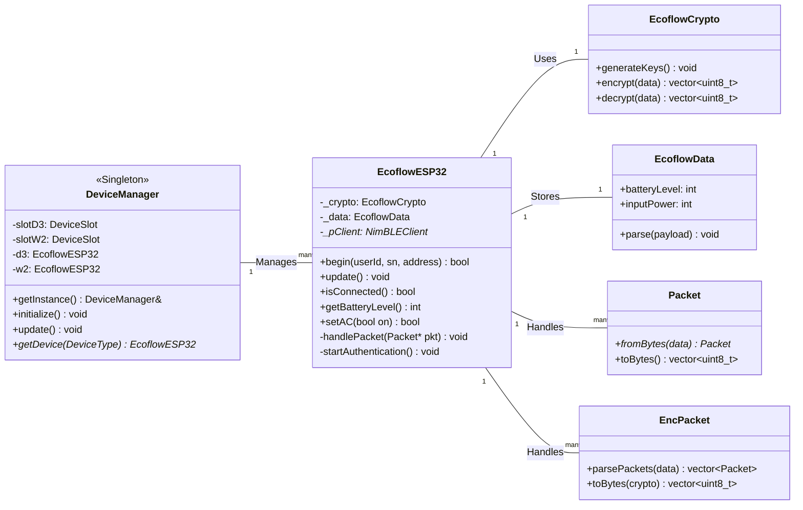

# Architecture Overview

The EcoflowESP32 library is designed with a clear, singleton-based architecture to manage device connections and interactions. The core components are the `DeviceManager` and the `EcoflowESP32` class.

## Class Diagram

This diagram illustrates the relationship between the key classes in the library.

## Core Components

### `DeviceManager`

The `DeviceManager` is the central nervous system of the library. As a **singleton**, it ensures that there is only one instance managing all device connections. Its primary responsibilities are:

-   **Discovery:** Scanning for and discovering specified EcoFlow devices.
-   **Connection Management:** Handling the connection and reconnection logic for multiple devices.
-   **State Caching:** Storing and retrieving device credentials from non-volatile storage.
-   **Device Access:** Providing a single point of access to the individual `EcoflowESP32` instances.

### `EcoflowESP32`

This is the main class that represents a single EcoFlow device. Each instance is responsible for:

-   **BLE Client:** Managing the underlying NimBLE client and its connection state.
-   **Authentication:** Executing the entire authentication handshake.
-   **Command Interface:** Providing the public API for sending commands (e.g., `setAC()`) and receiving data (e.g., `getBatteryLevel()`).
-   **Packet Handling:** Parsing incoming `EncPacket`s and `Packet`s and directing them to the appropriate handlers.

### `EcoflowCrypto`

This class abstracts all cryptographic operations, including:

-   Generating the ECDH public/private key pair.
-   Calculating the shared secret.
-   Deriving the AES key and IV.
-   Performing AES-128-CBC encryption and decryption.

### `Packet` and `EncPacket`

These classes are data structures that represent the two layers of the EcoFlow BLE protocol. They contain the logic for serializing and deserializing the packets to and from byte arrays, including checksum and CRC validation.
