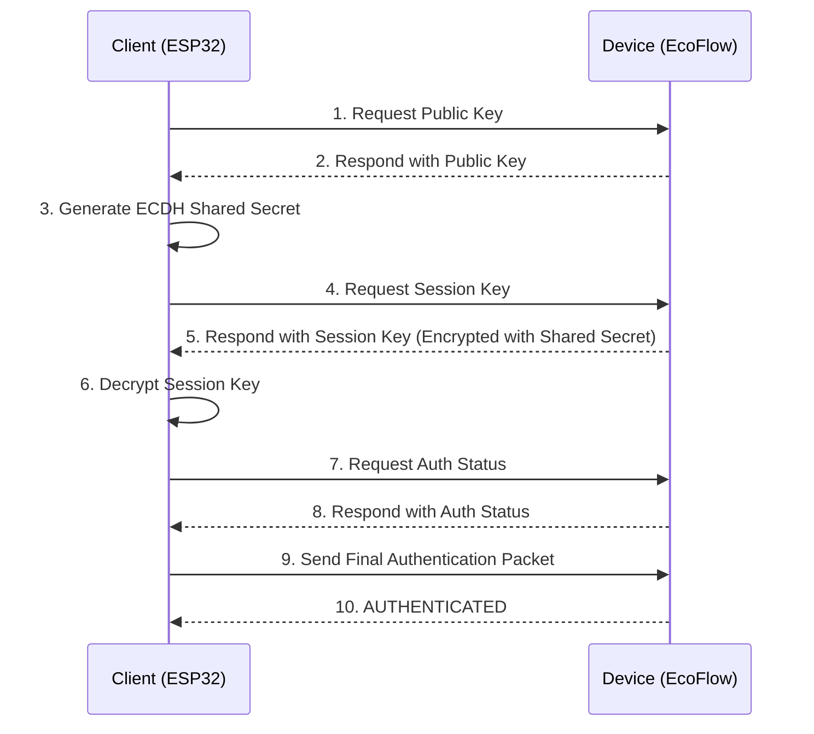

# Protocol Deep Dive

The EcoFlow BLE protocol is a sophisticated system involving a multi-step authentication handshake, nested packet structures, and AES-128-CBC encryption. This document breaks down the key components.

## Packet Structure

Communication relies on a nested packet format. An outer, encrypted packet (`EncPacket`) wraps one or more inner `Packet`s that contain the actual commands.

```mermaid
graph TD
    A[BLE Notification] --> B{EncPacket};
    B --> C{AES Decryption};
    C --> D[Inner Plaintext];
    D --> E{Packet 1};
    D --> F{...};
    D --> G{Packet N};

    subgraph EncPacket
        direction LR
        H(Prefix 0x5a5a) --> I(Header) --> J(Encrypted Payload) --> K(CRC16);
    end

    subgraph Inner Packet
        direction LR
        L(Prefix 0xaa) --> M(Header) --> N(Payload) --> O(Checksum);
    end

    E --> Inner Packet;
    B --> EncPacket;
```

### `EncPacket` (Encrypted Wrapper)

The `EncPacket` is the outer container for all authenticated communication.

| Field          | Size (bytes) | Description                                       |
|----------------|--------------|---------------------------------------------------|
| `Prefix`       | 2            | Always `0x5A5A`.                                  |
| `Header`       | 4            | Contains frame type, payload type, and length.    |
| `Payload`      | Variable     | The AES-128-CBC encrypted inner `Packet`(s).      |
| `CRC16`        | 2            | A CRC-16/MODBUS checksum of the header and payload.|

### `Packet` (Inner Command)

The `Packet` contains the actual command being sent to or received from the device.

| Field          | Size (bytes) | Description                                       |
|----------------|--------------|---------------------------------------------------|
| `Prefix`       | 1            | Always `0xAA`.                                    |
| `Header`       | 13           | Contains length, version, sequence, addresses, etc.|
| `Payload`      | Variable     | The command payload (often a serialized protobuf).|
| `Checksum`     | 1            | An 8-bit checksum of the header and payload.      |

## Authentication Handshake

Establishing a secure connection requires a precise, multi-step handshake.



1.  **Public Key Exchange:** The client and device exchange public keys using the `secp160r1` elliptic curve.
2.  **Shared Secret Generation:** Both sides use ECDH to derive a 20-byte shared secret.
3.  **Session Key Derivation:** The AES key and IV are derived from this shared secret. The IV is the MD5 hash of the full secret, and the key is the first 16 bytes of the secret.
4.  **Final Authentication:** The client sends a final packet to confirm the secure connection. The device responds, and from this point on, all communication is encrypted.
